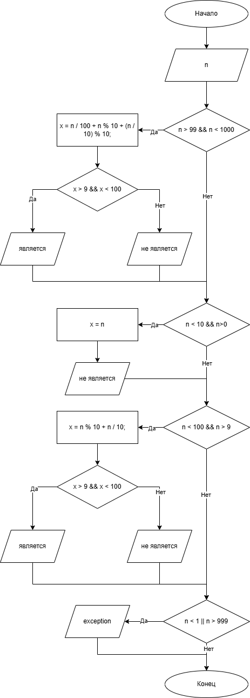

# Домашнее задание 1 к работе 6

## Условие задачи
Дано число N (N<1000). Написать программу, которая проверяет является ли его сумма цифр двухзначным числом.

## 1. Алгоритм и блок-схема

### Алгоритм
1. **Начало**
2. Инициализировать переменные:
   - `n` (int) - вводимое число;
   - `x` (int) - переменная сумматор.
3. Проверка условия:
   - `n > 99 && n < 1000` - проверка на трехзначность исходного числа;
     * `x > 9 && x < 100` - проверка на двухзначность суммы цифр исходного числа.
   - `n < 10 && n>0` - прверка на однозначность исходного чилса;
   - `n < 100 && n > 9` - проверка на двухзначность исходного числа;
     * `x > 9 && x < 100` - проверка на двухзначность суммы цифр исходного числа.
   - `n < 1 || n > 999` - обработка исключений.
4. Произвести вычисления:
   - произвести сумму цифр исходного числа при помощи переменной `x`, чтобы выполнить проверку условия.
5. Вывести текстовый ответ в зависимости от обработки условия.
6. **Конец**

### Блок-схема
 

[https://github.com/glebofrl/lab6VSU/blob/master/scheme.png](https://github.com/glebofrl/lab5VSU/blob/master/scheme.png)

## 2. Реализация программы

```
#include <stdio.h>
#include <locale.h>


void main()
{
	setlocale(LC_CTYPE, "RUS");

	int n, x;

	printf("Введите число N, при N<1000: ");
	scanf("%d", &n);

	if (n > 99 && n < 1000)
	{
		x = n / 100 + n % 10 + (n / 10) % 10;
		if (x > 9 && x < 100)
			printf("Сумма цифр числа %d является двухзначным числом, так как сумма равна %d\n", n, x);
		else
			printf("Сумма цифр числа %d не является двухзначным числом, так как сумма равна %d\n", n, x);
	}
	if (n < 10 && n>0)
	{
		x = n;
		printf("Сумма цифр числа %d не является двухзначным числом, так как сумма равна %d\n", n, x);
	}
	if (n < 100 && n > 9) 
	{
		x = n % 10 + n / 10;
		if (x > 9 && x < 100)
			printf("Сумма цифр числа %d является двухзначным числом, так как сумма равна %d\n", n, x);
		else
			printf("Сумма цифр числа %d не является двухзначным числом, так как сумма равна %d\n", n, x);
	}
	if (n < 1 || n > 999)
		printf("Введено некорректное число - перезапустите программу!");
}
```

## 3. Результаты работы программы


## 4. Информация о разработчике

Глебов Илья, бИПТ-252
